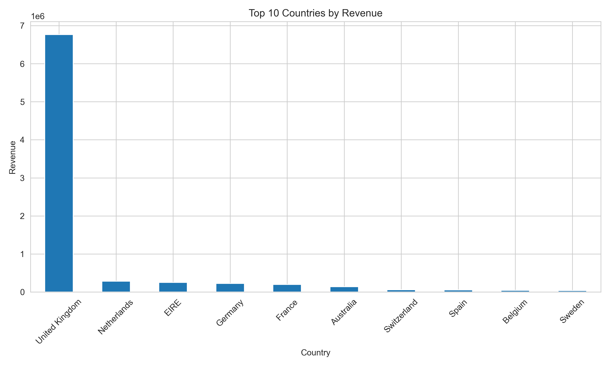
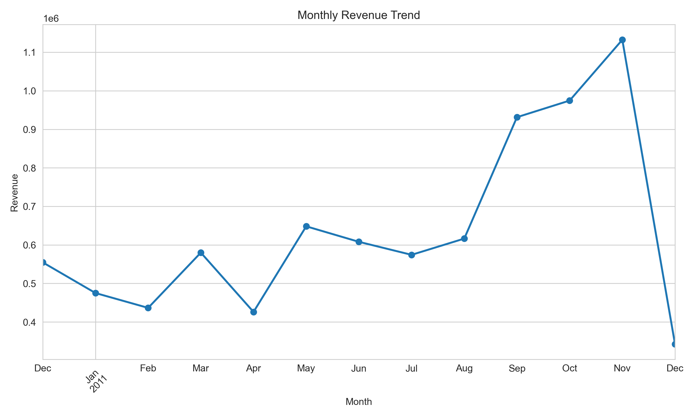
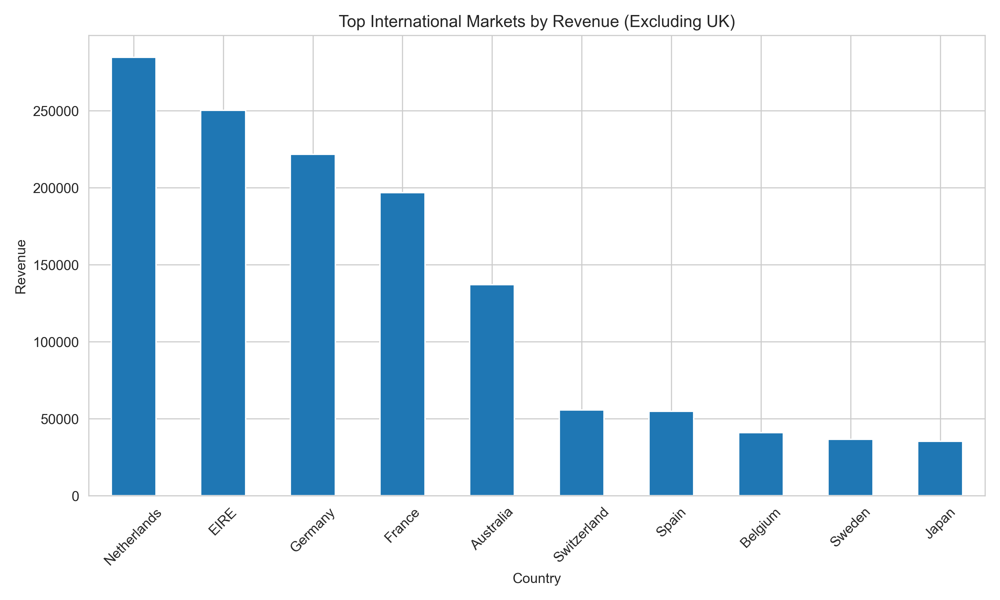
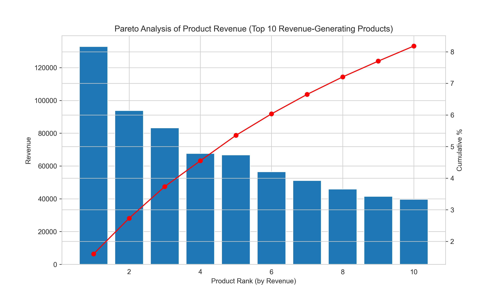
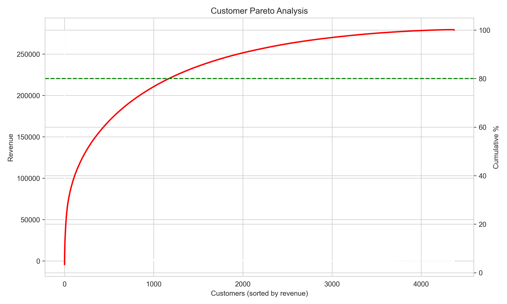

# E-Commerce Sales Analysis

Python data analysis project exploring e-commerce sales performance, customer concentration and international market opportunities.

---

## Project Overview

This project analyses e-commerce transaction data to identify key drivers of revenue and customer behaviour.

The analysis explores:

- Revenue distribution across products
- Geographic sales performance
- Customer concentration and high-value customers
- Monthly revenue trends and seasonality

The goal is to generate insights that could help an e-commerce business improve inventory management, marketing strategy, and customer retention.

---

## Key Visualisations

---

## Dataset

The dataset contains **541,000+ transactions** from an e-commerce retailer and includes:

- Invoice number
- Product SKU
- Product description
- Quantity purchased
- Invoice date
- Unit price
- Customer ID
- Country

The dataset used in this analysis is the **Online Retail dataset**.

Source:  
https://archive.ics.uci.edu/ml/datasets/Online+Retail

Due to file size limitations the dataset is not included in this repository.

---

## Tools Used

Python  
Pandas  
Matplotlib  
Jupyter Notebook  
GitHub  

---

## Methodology

The analysis followed these key steps:

1. Data cleaning and preprocessing
   - Removed cancelled transactions
   - Removed negative quantities
   - Created revenue field (Quantity × Unit Price)

2. Feature engineering
   - Extracted month from invoice dates
   - Aggregated revenue by product, customer and country

3. Exploratory analysis
   - Revenue by country
   - International market comparison
   - Monthly revenue trends
   - Product revenue distribution
   - Customer concentration (Pareto analysis)

4. Business interpretation
   - Identified revenue concentration patterns
   - Highlighted seasonal demand trends
   - Generated strategic business recommendations

---

## Key Analyses

## Revenue by Country

This chart shows where the business generates the majority of its revenue.

### Insight

The United Kingdom accounts for the majority of revenue. However, several international markets also generate meaningful sales.

---

## International Market Opportunity

Removing the UK reveals the strongest international markets.

### Insight

The Netherlands, Ireland, Germany, and France are the most significant non-UK markets.

These markets may represent opportunities for targeted marketing, localisation strategies, or expanded logistics support.

---

## Monthly Revenue Trend

### Insight

Revenue rises significantly in the final quarter of the year, indicating strong **seasonality and holiday demand**.

Businesses could prepare by:

- Increasing inventory
- Scaling advertising
- Improving fulfilment capacity

---

## Product Revenue Concentration (Pareto Analysis)

### Insight

Revenue is distributed across a wide range of products rather than being concentrated in a few best sellers.

The top 10 products generate only a small share of total revenue, indicating that many SKUs contribute meaningfully to overall sales.

This suggests the business relies on a **broad product catalogue rather than a few dominant items.**

---

## Customer Revenue Concentration

### Insight

Approximately **27% of customers generate around 80% of revenue**, indicating a strong concentration of value among a relatively small customer segment.

This suggests opportunities for:

- Customer loyalty programs
- Targeted retention strategies
- VIP customer segmentation

---

## Business Recommendations

Based on the findings from the analysis, several strategic actions could improve business performance:

### Maintain a diverse product portfolio

Revenue is distributed across many products rather than concentrated in a few best sellers.

This suggests the business benefits from maintaining a **broad product range** rather than relying on a small number of hero products.

Possible strategies include:

- Ensuring consistent availability across a wide SKU range
- Monitoring long-tail products that contribute steady revenue
- Avoiding over-concentration on a small set of items

---

### Expand high-potential international markets

Countries such as:

- Netherlands  
- Ireland  
- Germany  
- France  

show strong demand outside the UK.

---

### Prepare for seasonal demand spikes

Revenue increases significantly during Q4, suggesting strong seasonal demand leading up to the holiday period.

Planning inventory levels and marketing campaigns ahead of this period could help maximise sales during peak demand.

---

### Retain high-value customers

Customer analysis shows that a relatively small proportion of customers contributes a large share of revenue.

Focusing on retaining these customers could improve long-term profitability.

Possible strategies include:

- Loyalty programs
- Personalised offers
- Customer retention campaigns

---

